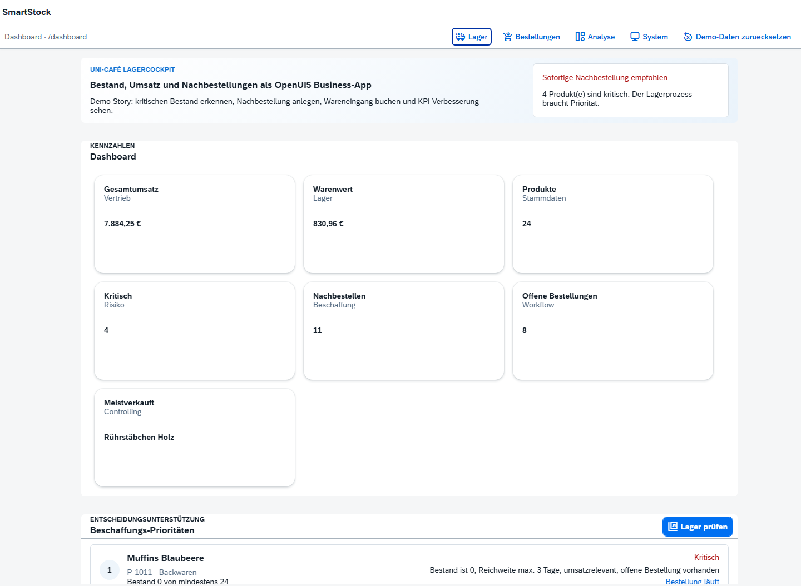
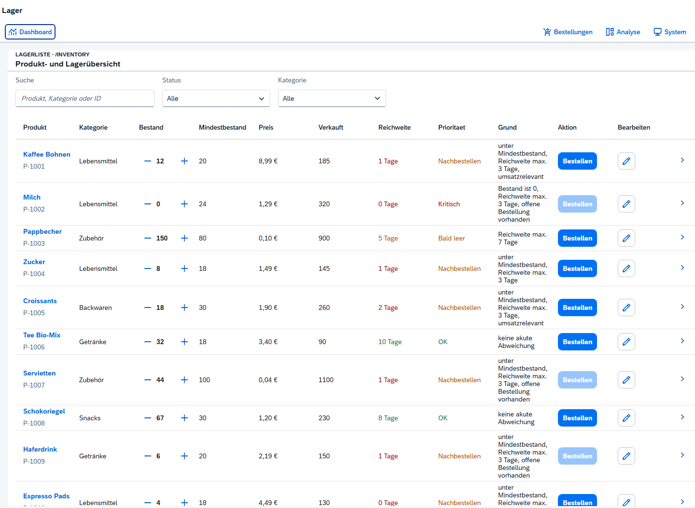
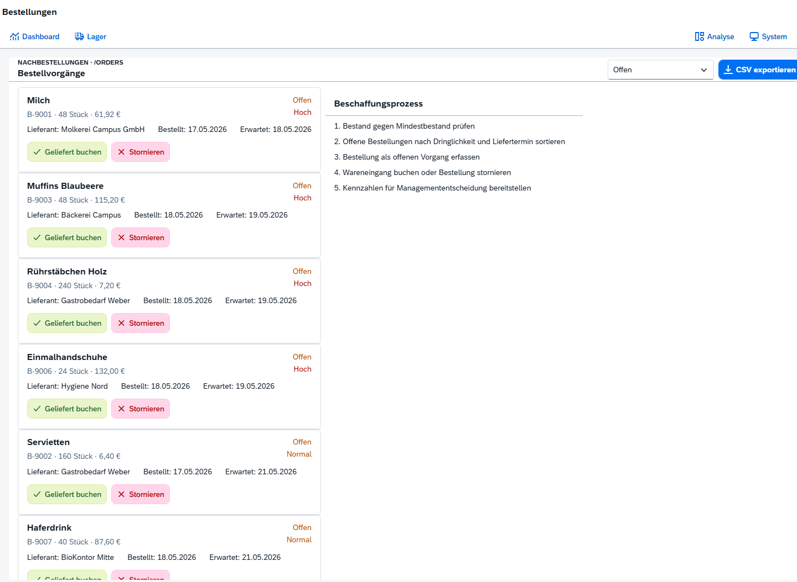
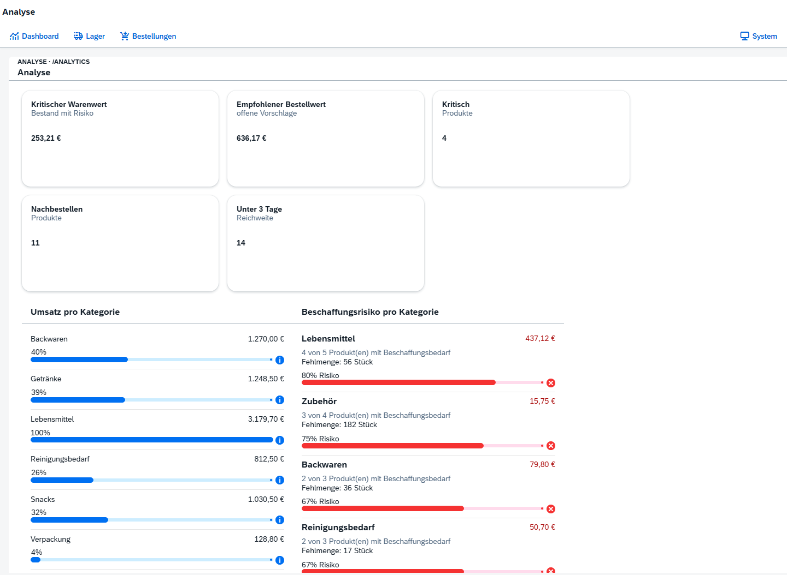
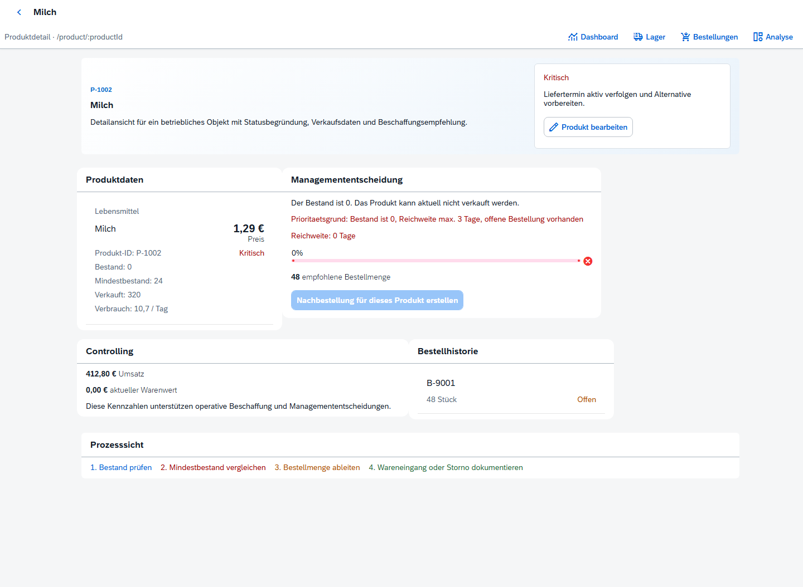

# SmartStock

SmartStock ist eine OpenUI5-Webanwendung zur Lagerüberwachung und Bestellunterstützung für ein kleines Unternehmen. Das Projekt verbindet einen operativen Bestellprozess mit Kennzahlen, Bestandswarnungen und einer managementorientierten Analysesicht.



## Funktionen

- Dashboard mit automatisch berechneten Kennzahlen und klickbaren KPI-Kacheln
- Lagerübersicht mit Suche, Statusfilter und Kategorieauswahl
- Pflege von Bestand, Mindestbestand, Preis und Verkaufsmenge
- Nachbestellung, Wareneingang und Stornierung mit Eingabevalidierung
- Automatische Bestandserhöhung nach gebuchtem Wareneingang
- CSV-Export für Bestellungen
- Analyse von Umsatz, Kapitalbindung, Reichweite und Beschaffungsrisiken
- Produktdetailseite mit Bestellhistorie und Handlungsempfehlung
- Lokaler OData-v2-naher Mock-Service mit Metadata, Entity Sets und Associations

## Technologie

- OpenUI5 und SAPUI5-Programmiermodell
- MVC-Struktur mit Component, Manifest, XML Views und Controllern
- Routing, Data Binding und JSONModel
- Fiori-orientierte Navigation, Statusdarstellung und KPI-Kacheln
- OData-v2-Mock mit `ProductSet`, `OrderSet` und `metadata.xml`
- HTML5, CSS und JavaScript

## Fachlicher Ablauf

```text
Bestand prüfen -> kritischen Artikel erkennen -> Nachbestellung anlegen
-> offene Bestellung bearbeiten -> Wareneingang buchen -> Bestand aktualisieren
```

## Lokal starten

Die Anwendung lädt OpenUI5 über das offizielle CDN und benötigt deshalb eine Internetverbindung.

```bash
python3 -m http.server 5173
```

Danach `http://localhost:5173` öffnen.

## Screenshots

| Lager | Bestellungen |
|---|---|
|  |  |

| Analyse | Produktdetail |
|---|---|
|  |  |

## Einordnung

SmartStock entstand im Wintersemester 2025/26 als Hochschul-Gruppenprojekt im Modul „Programmierung von Informationssystemen“. Die in diesem Repository enthaltene Anwendung und ihr Quellcode wurden vollständig von mir implementiert. Weitere Gruppenmitglieder wirkten an Tests, Bericht und Präsentation mit.

Dieser öffentliche Portfolio-Snapshot enthält ausschließlich die ausführbare Anwendung, synthetische Mock-Daten und ausgewählte Screenshots. Gemeinsame Abgabeunterlagen, Präsentationen, personenbezogene Daten und die private Projektgeschichte sind bewusst nicht enthalten.

SmartStock verwendet kein produktives SAP Gateway und ist nicht in einem echten Fiori Launchpad bereitgestellt. Der OData-Dienst wird lokal simuliert; die App demonstriert das OpenUI5-/SAPUI5-Programmiermodell und Fiori-Prinzipien.

## Nutzung

Das Repository dient als persönlicher Portfolio-Nachweis. Es wird keine Open-Source-Lizenz erteilt.
